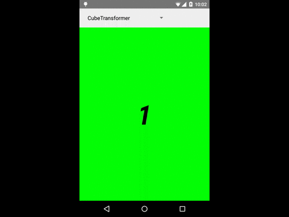
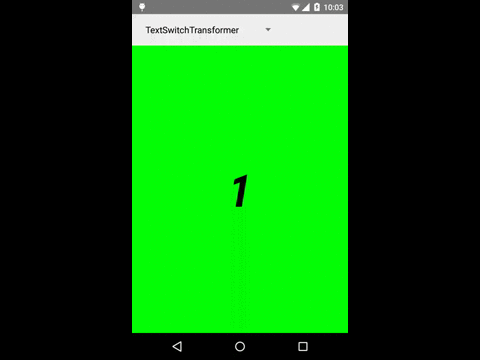

# Cooler Screen Transitions in Android

Inspiration
-----------

Recently I found very cool introduction screen in Google Drive App, shown below:


I really liked google color transition between screens. It was my inspiration to create this cool color transition by myself. I started searching about screen transition in Android Framework and I've found this: [Using ViewPager for Screen Slides]. So the easiest way to create screen transition effects is to use [ViewPager] and [PageTransformer]. I will focus on [PageTransformer] through this post.

Introduction to PageTransformer
-------------------------------

[PageTransformer] is simple `Interface` that has single method `transformPage(View page, float position)`. This method is triggered every time the screen position changed. It provides reference to the root [View] of the `page` and value which represents visible fraction of that page.

`position` value provides information about page fraction:

```java
    if (position < -1) { // [-Infinity,-1)
        // This page is way off-screen to the left.
    } else if (position < 0) { // [-1,0)
        // Left visible page fraction
    } else if (position == 0) {
        // One page centered
    } else if (position > 0 && position <= 1) { // (0, 1]
        // Right visible page fraction
    } else { // (1, Infinity]
        // This page is way off-screen to the right.
    }
```

So we have everything to create this beautiful color effect !!!

Preparation
-----------

To play with transitions I created small example project which can be found here: [Github].

So I've started with default transition:


There is no straight way to get current page index, but I found easy solution:

```java
    @Override
    public void onViewCreated(final View view, final Bundle savedInstanceState) {
   		final int position = getArguments().getInt(ARG_POSITION);
   		final String text = MainActivity.Content.values()[position].getText();

   		view.setTag(position); // saving index

   		final TextView contentTextView = (TextView) view.findViewById(R.id.contentTextView);
   		contentTextView.setText(text);
   	}
```

```java
    @Override
	public void transformPage(final View page, final float position) {
		final int pageIndex = (Integer) page.getTag(); // reading index
		transformPage(page, pageIndex, position);
	}
```

Because we get the same `view` in `onViewCreated(...)` and `transformPage(...)`, I used `View.setTag(Object)`, `View.getTag()` to save current [ViewPager] index. With this simple utility I created `BasePageTransformer` class which adds `abstract transformPage(View page, int pageIndex, float position)` method. It will help me with color transition later.

Color Transition
----------------

```java
    public class ColorTransformer extends BasePageTransformer {

        private static int blendColors(int color1, int color2, float ratio) {
            final float inverseRation = 1f - ratio;
            float r = (Color.red(color1) * ratio) + (Color.red(color2) * inverseRation);
            float g = (Color.green(color1) * ratio) + (Color.green(color2) * inverseRation);
            float b = (Color.blue(color1) * ratio) + (Color.blue(color2) * inverseRation);
            return Color.rgb((int) r, (int) g, (int) b);
        }

        @SuppressWarnings("UnnecessaryLocalVariable")
        @Override
        public void transformPage(final View page, final int pageIndex, final float position) {

            if (inRange(position)) { // [-1, 1]
                if (isRightPage(position)) { //(0, 1]

                    final int leftIndex = pageIndex - 1;
                    final int rightIndex = pageIndex;

                    final int leftColor = MainActivity.Content.values()[leftIndex].getColor();
                    final int rightColor = MainActivity.Content.values()[rightIndex].getColor();

                    final int composedColor = blendColors(leftColor, rightColor, position);
                    page.setBackgroundColor(composedColor);

                } else if (isLeftPage(position)) { //[-1, 0)

                    final int leftIndex = pageIndex;
                    final int rightIndex = leftIndex + 1;

                    final int leftColor = MainActivity.Content.values()[leftIndex].getColor();
                    final int rightColor = MainActivity.Content.values()[rightIndex].getColor();

                    final int composedColor = blendColors(leftColor, rightColor, 1 - Math.abs(position));
                    page.setBackgroundColor(composedColor);

                } else { // position == 0
                    page.setBackgroundColor(MainActivity.Content.values()[pageIndex].getColor());
                }
            } else { //(-Infinity, -1) or (1, + Infinity)
                page.setBackgroundColor(MainActivity.Content.values()[pageIndex].getColor());
            }
        }
    }
```

I found `blendColors(int color1, int color2, float ratio)` in [SlidingTabStrip] class written by google. It basically blends two color with specific ratio - exactly what we want.

I think that the code is really straightforward, find neighbour pages indexes, get appropriate colors, blend them with proper ratio, set background color with new color.

Result:


Other transitions
-----------------

I was playing with transformation a little longer, the results you can see below. Every transformation source code can be found on [Github].

**Enjoy playing with transformations !!!!**

###### Cube Transformer


###### Text Switch Transformer


###### Rotation Transformer


###### Up Transformer


Sebastian Staszyński,
Android Developer in [DroidOnRoids]
<sebastian.staszynski@droidsonroids.pl>

[Using ViewPager for Screen Slides]: http://developer.android.com/training/animation/screen-slide.html#pagetransformer
[ViewPager]: http://developer.android.com/reference/android/support/v4/view/ViewPager.html
[PageTransformer]: http://developer.android.com/reference/android/support/v4/view/ViewPager.PageTransformer.html
[View]: http://developer.android.com/reference/android/view/View.html
[SlidingTabStrip]: https://android.googlesource.com/platform/development/+/0b3758ea4e53f9bfd0b112eaa4a7dd7b7f4040f5/samples/browseable/SlidingTabsBasic/src/com.example.android.common/view/SlidingTabStrip.java
[GitHub]: https://github.com/DroidsOnRoids/PageTransformerDemo
[DroidOnRoids]: http://www.thedroidsonroids.com/